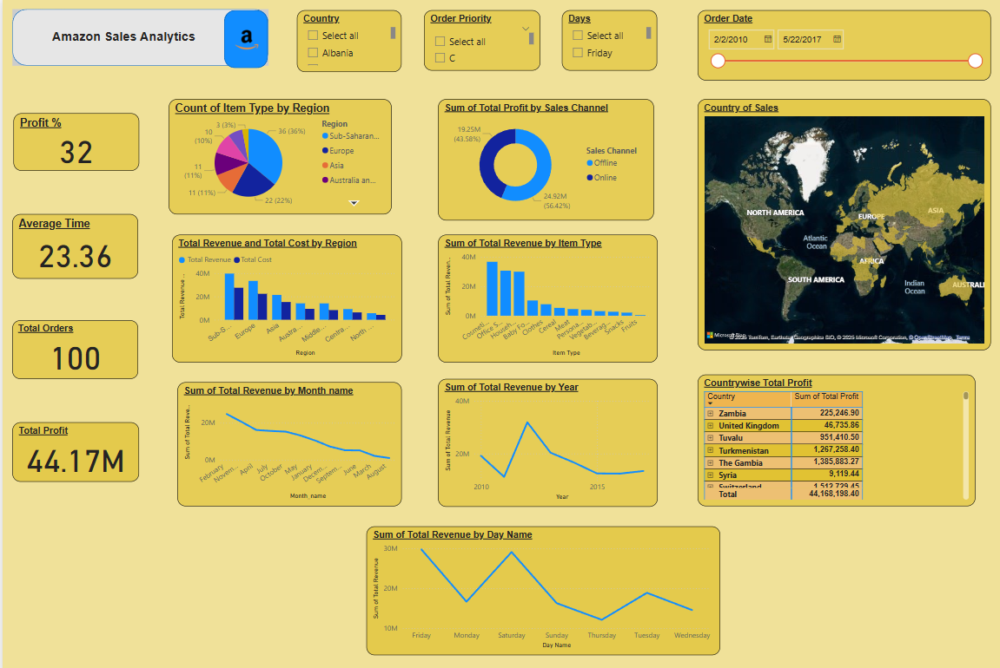
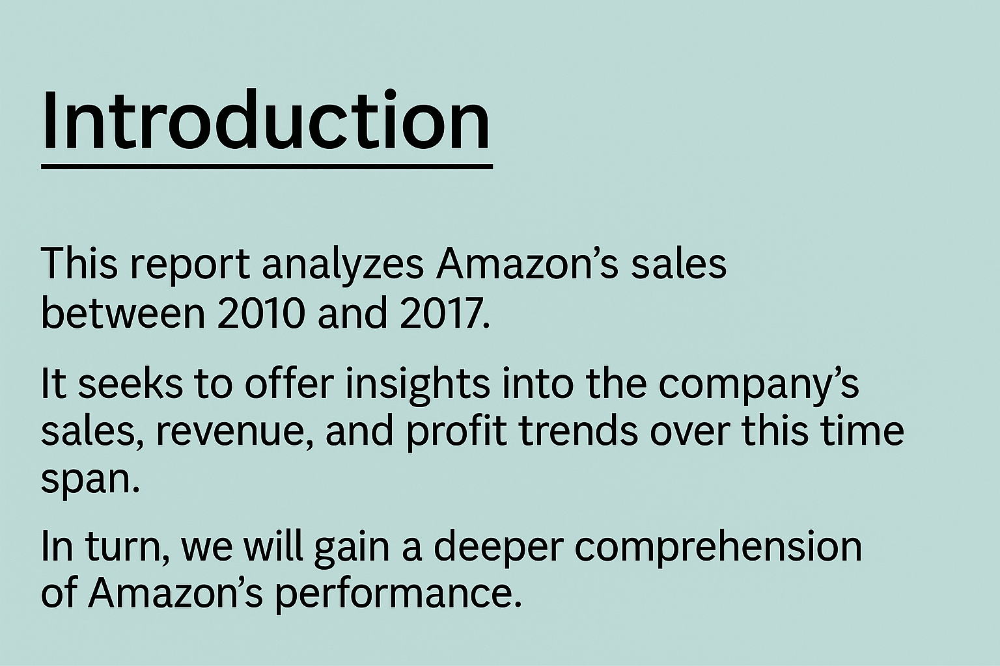

# Project Overview:
## Project Title: Amazon Sales Analytics Dashboard

## Project Description:
This Power BI dashboard provides a detailed visual analysis of Amazon's sales data from 2010 to 2017. It is designed to help explore key performance indicators, trends, and patterns across various aspects of the business. The dashboard offers an interactive interface to analyze:

- **Overall Business Performance**: KPIs such as Total Profit, Total Orders, Average Processing Time, and Profit Percentage give a high-level summary of operational success.
- **Sales Channel Insights**: A doughnut chart compares online and offline profit contributions, showcasing each channel’s financial impact.
- **Regional Sales Distribution**: A geographic map highlights sales activity across different countries and regions, helping identify top markets.
- **Item Type Analysis**: Bar charts show which product categories generate the most revenue and profit.
- **Revenue & Cost Breakdown**: Regional breakdown of total revenue and cost, aiding in performance comparison by location.
- **Temporal Trends**: Line charts display revenue patterns by year, month, and day of the week, helping to detect seasonality and periodic sales behavior.
- **Order Priority Analysis**: Allows filtering based on order urgency to analyze its effect on overall performance.

---

## Key Features:
- **Interactive Filters**: Slicers for country, date, sales channel, order priority, and days provide a personalized analysis experience.
- **Drill-Down Options**: Users can dive deeper into specific data segments for granular insights.
- **Visual KPIs**: Real-time indicators show performance at a glance.
- **User-Friendly Layout**: Visually engaging layout ensures easy navigation and clarity.

---

## Project Goals:
- To deliver a clear visualization of Amazon’s sales trends and business metrics.
- To support data-driven decisions through interactive and easy-to-understand visuals.
- To identify high-performing product types, regions, and time periods.
- To present an analysis tool for business users, analysts, and executives.

---

## Target Audience:
This dashboard is intended for sales analysts, business managers, decision-makers, and stakeholders seeking actionable insights from Amazon’s historical sales data.

---

### Overall Report & Dashboard Glimpse:

